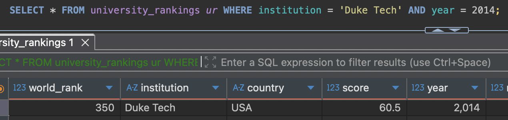

# IDS706_assignment_03
This is a repository for assignment 3: [Introduction to Databases](https://canvas.duke.edu/courses/60978/assignments/288605)

## 1. Connect to database
The steps to connecting to the database are:
1. Download the pre-built SQLite database and DBeaver
2. Once in DBeaver, select **New Database connection** in **Database** section

3. Select **SQLite** and click Next

4. Select the right **Path** location and click on Finish

5. The connection is made

## 2. Perform Basic Analysis
Write SQL queries to explore the dataset, including basic statistics and summary operations.

## 3. CRUD 
Perform the CRUD operations below.

### i. Insertion

The ranking committee has decided to publish new results for a new university in 2014. Insert this university into the database.
- Institution: Duke Tech
- Country: USA
- World Rank: 350
- Score: 60.5

Before row insertion: 

After row insertion: 

### ii. Read
A policy consultant has reached out to you with the following question. How many universities from Japan show up in the global top 200 in 2013?

### iii. Update
The score for University of Oxford in 2014 was miscalculated. Increase its score by +1.2 points. Update the row to reflect this update.

Before row update: 

After row update: 

### iv. Delete
After reviewing, the ranking committee decided that universities with a score below 45 in 2015 should not have been included in the published dataset. Clean up the records to reflect this.

Before row deletion: 

After row deletion: 

