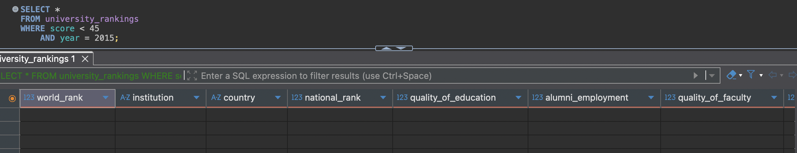

# IDS706_assignment_03
This is a repository for assignment 3: [Introduction to Databases](https://canvas.duke.edu/courses/60978/assignments/288605)

**SQLite Database Assignment**

This project focuses on database fundamentals using SQLite, where I perform data analysis and CRUD operations on a university rankings dataset. I connected to the SQLite database using Dbeaver, then wrote SQL queries to explore the data and execute required operations including inserting a new row, calculating country-specific rankings, correcting score values, and filtering records based on quality thresholds. The SQL queries demonstrate practical database management skills through real-world data manipulation scenarios.

## 1. Connect to database
The steps to connecting to the database are:
1. Download the pre-built SQLite database and DBeaver
2. Once in DBeaver, select **New Database connection** in **Database** section

3. Select **SQLite** and click Next

4. Select the right **Path** location and click on Finish

5. The connection is made

## 2. Perform Basic Analysis
Write SQL queries to explore the dataset, including basic statistics and summary operations.

### i. General statistics

```sql
SELECT COUNT(DISTINCT country) AS n_countries,
    COUNT(DISTINCT institution) AS n_institutions,
    COUNT(DISTINCT year) AS n_years,
    MAX(score) AS max_score,
    MIN(score) AS min_score,
    AVG(score) AS avg_score
FROM university_rankings;
```

#### Results
- Countries: 59
- Institutions: 1,005
- Years: 4
- Max Score: 100
- Min Score: 43.36
- Average Score: 48.96

### ii. Country Performance Rankings
Compare countries by their highest-performing institutions and research output metrics.

```sql
SELECT country,
	COUNT(DISTINCT institution) AS n_institutions,
	MIN(score) AS min_score,
	MAX(score) AS max_score,
	MIN(world_rank) AS min_world_rank,
	MAX(world_rank) AS max_world_rank,
	COUNT(publications) AS n_publications,
	COUNT(citations) AS n_citations,
	COUNT(patents) AS n_patents
FROM university_rankings ur
GROUP BY country
ORDER BY max_score DESC
LIMIT 15;
```


#### Key Insights
- USA dominates with the highest max score (100) and top world rank (#1)
- Israel shows high performance with only 7 institutions but 66.76 max score
- Switzerland demonstrates high quality with few institutions (9)
- China has the most institutions (84) without considering USA but lower maximum scores


### iii. Top Institutions - USA and United Kingdom

Analyze the top 10 institutions from USA and United Kingdom with detailed metrics per institution.


#### Key Insights
These insights were done with AI

**Harvard is #1 across the board**
- Perfect 100 score every year
- Always ranked #1 worldwide and nationally
- Leads in all research metrics

**US schools dominate the list**
- 8 of the top 10 are American universities
- Only Cambridge and Oxford break into the top tier from UK

**MIT punches above its weight**
- Small publication numbers but elite faculty quality (ranked 2.25)
- Consistently top 3 worldwide despite smaller research output

**British universities hold their ground**
- Cambridge and Oxford consistently rank #1-2 in the UK
- Both maintain world rankings in the top 5

**Score consistency varies**
- Harvard never wavers from 100
- Columbia has biggest swing (78-97)
- Most schools stay within 10-15 point range

**Publication numbers don't tell whole story**
- Princeton publishes most but ranks lower globally
- Top schools balance quality vs quantity in research


## 3. CRUD 
Perform the CRUD operations below.

### i. Insertion

The ranking committee has decided to publish new results for a new university in 2014. Insert this university into the database.
- Institution: Duke Tech
- Country: USA
- World Rank: 350
- Score: 60.5

Before row insertion: 


After row insertion: 


### ii. Read
A policy consultant has reached out to you with the following question. How many universities from Japan show up in the global top 200 in 2013?


### iii. Update
The score for University of Oxford in 2014 was miscalculated. Increase its score by +1.2 points. Update the row to reflect this update.

Before row update: 


After row update: 


### iv. Delete
After reviewing, the ranking committee decided that universities with a score below 45 in 2015 should not have been included in the published dataset. Clean up the records to reflect this.

Before row deletion: 


After row deletion: 

